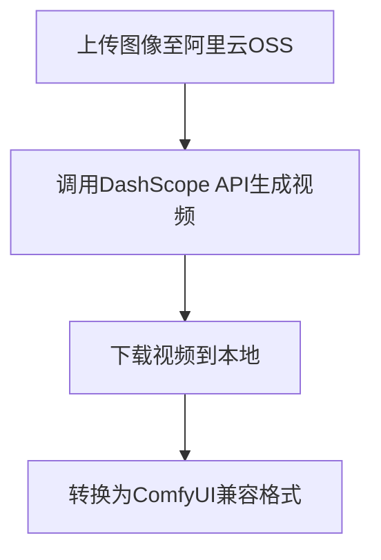

### **项目核心功能**

基于阿里云通义千问API实现「图像→视频」生成，在原版[comfyUI-WanAPI](https://github.com/Brender1925/comfyUI-WanAPI)基础上增强用户体验和监控能力。

---

### **新增亮点功能**
1. **进度可视化**
   - 关键步骤实时提示（如上传、生成、下载）
   - 每个阶段显示完成百分比
2. **耗时统计**
   - 各步骤精确计时（如API调用耗时、视频处理时间）
   - 终端输出总耗时报告
3. **密钥便捷输入**
   - 无需修改代码：直接在ComfyUI界面填写API-KEY
   - 兼容环境变量`DASHSCOPE_API_KEY`方式
4. **错误友好提示**
   - 网络超时/密钥错误等场景给出明确解决方案

---

### **完整工作流程**


---

### **安装步骤（3分钟完成）**
1. 进入ComfyUI自定义节点目录：
   ```bash
   cd ComfyUI/custom_nodes
   ```
2. 克隆本仓库：
   ```bash
   git clone https://github.com/msola-ht/ComfyUI-Wan-API.git
   ```
3. 安装依赖：
   ```bash
   pip install -r requirements.txt
   ```
4. 重启ComfyUI后即可在节点菜单中找到新功能

---

### **API密钥获取指南**
1. 访问[通义千问控制台](https://bailian.console.aliyun.com/#/home)
2. 完成新用户注册（享100万免费Tokens）
3. 在[API密钥管理页](https://bailian.console.aliyun.com/?tab=api#/api)创建并复制密钥
   

---

### **参数配置说明**
| 参数名          | 类型   | 必填 | 可选值/范围                               | 备注                        |
| --------------- | ------ | ---- | ----------------------------------------- | --------------------------- |
| `api_key`       | 字符串 | 是   | -                                         | 建议通过界面输入            |
| `model_name`    | 枚举   | 是   | `wanx2.1-i2v-turbo`<br>`wanx2.1-i2v-plus` | 默认turbo版                 |
| `duration`      | 整数   | 是   | turbo版:3-5秒<br>plus版:仅5秒             | 注意模型限制                |
| `resolution`    | 枚举   | 是   | `480P`, `720P`                            | plus版强制720P,影响生成质量 |
| `prompt_extend` | 布尔   | 是   | True/False                                | 是否自动扩展提示词          |

---

### **不同模型特性对比**
| 模型版本          | 生成速度         | 支持时长 | 适合场景     |
| ----------------- | ---------------- | -------- | ------------ |
| wanx2.1-i2v-turbo | 快（约3-5分钟）  | 3/4/5秒  | 快速原型制作 |
| wanx2.1-i2v-plus  | 慢（约7-10分钟） | 固定5秒  | 高质量输出   |

---

### **常见问题处理**

1. **生成失败**
   - 检查阿里云账户余额（免费额度是否用完）
   - 确认分辨率不超过720P
2. **视频模糊**
   - 尝试更换提示词（英文提示词效果更佳）
   - 选择plus模型获得更高质量
3. **超时错误**
   - 适当延长ComfyUI请求超时时间
   - 检查网络是否能访问阿里云API

---

- 如需进一步帮助，欢迎在GitHub提交Issue。
